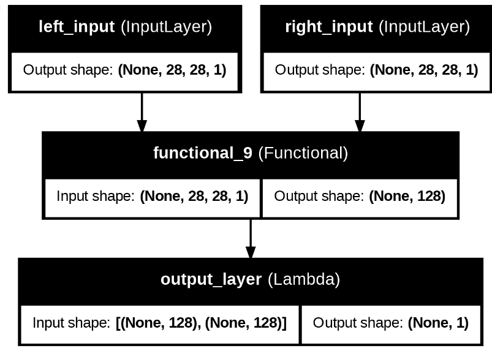
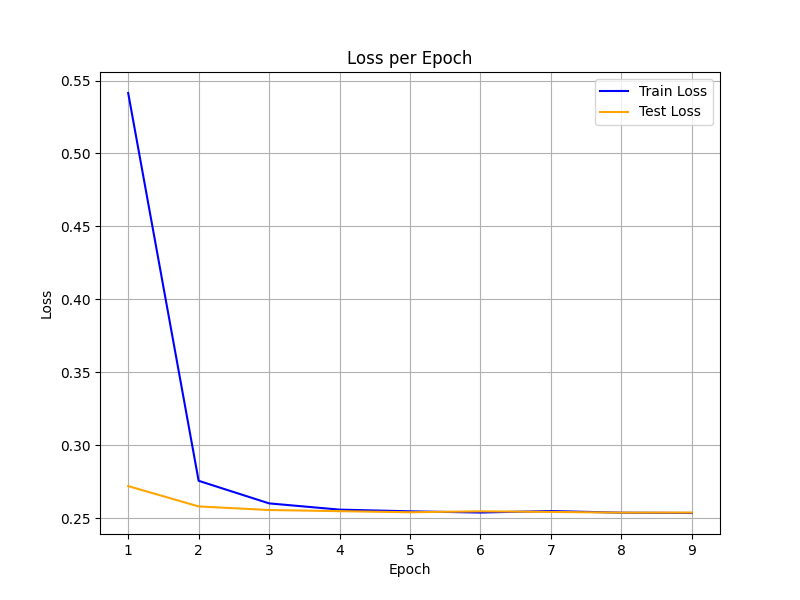
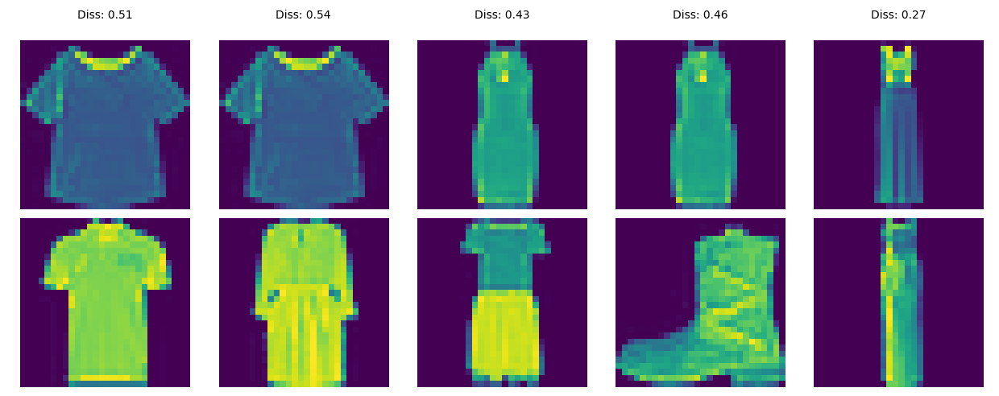

# Rede Siamesa com Fashion MNIST usando gRPC


Este projeto implementa uma rede siamesa utilizando o dataset **Fashion MNIST** com o objetivo de comparar a similaridade entre duas imagens. Usamos **gRPC** para criar um sistema distribuído, onde os clientes reportam o vetor de saída via gRPC para um servidor para calcular a distância e atualizar os gradientes da camada Lambda que define a similaridade das camadas.

## Descrição do Projeto

Este projeto utiliza redes neurais convolucionais para construir um **modelo siamesa** que compara pares de imagens do dataset Fashion MNIST. A rede siamesa é projetada para aprender a identificar similaridades ou diferenças entre duas imagens usando uma **função de perda contrastiva** baseada na **distância euclidiana** entre as projeções das imagens em um espaço de características.

### Tabela de Conteúdos
- [Modelo Siamesa](#modelo-siamesa)
- [Função de Perda Contrastiva](#função-de-perda-contrastiva)
- [Distância Euclidiana](#distância-euclidiana)
- [Implementação de gRPC](#implementação-de-grpc)
- [Como Executar](#como-executar)
- [Requisitos](#requisitos)

## Modelo Siamesa

Uma **rede siamesa** é uma arquitetura de rede neural utilizada para tarefas de comparação de similaridades. Ela consiste em duas sub-redes idênticas que compartilham os mesmos pesos e parâmetros, permitindo que as entradas (imagens) sejam projetadas em um espaço de características onde imagens similares estão próximas e imagens diferentes estão distantes.


O propósito do modelo Siamesa é que a rede possa calcular uma **distância** entre as representações de duas imagens no espaço de características. Se a distância for pequena, as imagens são similares; se for grande, são diferentes.



## Função de Perda Contrastiva

A **perda contrastiva** é uma função de perda projetada para redes siamesas. Ela penaliza as projeções incorretas com base na seguinte ideia:

- Se duas imagens são similares (mesma classe), o modelo deve minimizar a distância entre elas.
- Se duas imagens são diferentes (classes distintas), o modelo deve maximizar a distância entre elas.

A fórmula da perda contrastiva é a seguinte:
A função de perda utilizada para determinar a similaridade ou diferença entre duas imagens em um espaço de características projetado é a seguinte:

$$
L(Y, D_W) = Y \cdot \frac{1}{2} \cdot D_W^2 + (1 - Y) \cdot \frac{1}{2} \cdot \left( \max(0, m - D_W) \right)^2
$$

Onde:

- \( Y \) é o rótulo que indica se as imagens são iguais (1) ou diferentes (0).
- \( D_W \) é a distância euclidiana entre as duas imagens no espaço de características projetado.
- \( m \) é uma margem que determina quanta distância as imagens diferentes devem ter entre si.

### Explicação:

- Se \( Y = 1 \) (imagens iguais), usa-se o termo \( \frac{1}{2} \cdot D_W^2 \), que penaliza a distância entre as imagens, buscando que essa distância seja a menor possível.
- Se \( Y = 0 \) (imagens diferentes), utiliza-se o termo \( \frac{1}{2} \cdot \left( \max(0, m - D_W) \right)^2 \), que força as imagens diferentes a manterem uma distância maior ou igual a \( m \).




Ou:

$$
L(Y, D_W) = (1 - Y) \cdot \frac{1}{2} \cdot D_W^2 + Y \cdot \frac{1}{2} \cdot \left( \max(0, m - D_W) \right)^2
$$


Onde:

- \( Y \) é a etiqueta que indica se as imagens são iguais (0) ou diferentes (1).
- \( D_W \) é a distância euclidiana entre as duas imagens no espaço de características projetado.
- \( m \) é uma margem que determina quanta distância as imagens diferentes devem ter entre si.

### Intuição:
- Para imagens da mesma classe (Y=0), o modelo tenta minimizar \( D_W \), reduzindo a distância entre suas representações.
- Para imagens de classes diferentes (Y=1), o modelo maximiza a distância, mas apenas até um limite determinado pela margem \( m \).

## Distância Euclidiana

A **distância euclidiana** é a distância "ordinária" entre dois pontos em um espaço euclidiano. Dado um par de pontos \( p \) e \( q \), a distância euclidiana entre eles é definida como:


$$
D(p, q) = \sqrt{\sum_{i=1}^{n} (p_i - q_i)^2}
$$


No nosso caso, \( p \) e \( q \) são as representações das imagens após passarem pela rede siamesa. A distância euclidiana mede a diferença entre ambas as representações.

Esta distância é usada para determinar o quão similares são duas imagens no espaço de características aprendido pelo modelo. Se a distância for pequena, as imagens são similares, e se for grande, as imagens são diferentes.

## Implementação de gRPC

Este projeto também utiliza **gRPC** para permitir que o modelo treinado se comunique através da rede. O cliente pode enviar dois embeddings para o servidor, e o servidor retornará a similaridade entre elas com base na distância euclidiana entre suas representações.

O fluxo de trabalho é o seguinte:

1. O cliente passa pela rede siamesa duas imagens e as converte em embeddings e as envia para o servidor.
2. O servidor e calcula a distância euclidiana y a perda.
3. O servidor responde ao cliente com a distância (ou "similaridade") calculada e os gradientes.

## Como Executar

### Servidor gRPC

Para a descarga da  base de dados:

```bash
python loadDataset.py
```
Para iniciar o servidor gRPC, execute o seguinte comando:

```bash
python server.py
```
Para iniciar o cliente gRPC, execute o seguinte comando:

```bash
python client.py
```

Para plotar os graficos:

```bash
python plotLoss.py
```

Para fazer inferencia :

```bash
python prediction.py
```


