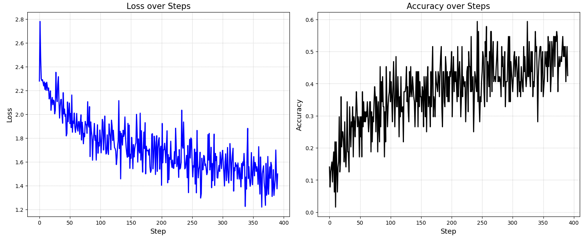

# Exercício - Entregável

Este projeto implementa um sistema de treinamento com múltiplos clientes e um único servidor, seguindo as especificações apresentadas no laboratório. As principais modificações foram realizadas para suportar a execução distribuída e a implementação de um treinamento de *Split-Learning* no formato *U-Shaped*.

## Tarefas Realizadas

1. **Permitir a execução de múltiplos clientes**  
   O código foi alterado para suportar a execução simultânea de múltiplos clientes utilizando as ferramentas de paralelismo e distribuição do laboratório 7 (Ray). Cada cliente é instanciado e executado de forma independente, comunicando-se com o servidor durante o processo de treinamento.

2. **Separação de dados entre os clientes**  
   A distribuição dos dados foi configurada de forma que cada cliente recebe porções distintas do conjunto de dados. Esta abordagem garante que cada cliente processa diferentes partes dos dados, melhorando a eficiência e a escalabilidade do treinamento distribuído.

3. **Implementação do treinamento com Split-Learning no formato U-Shaped**  
   O treinamento no formato *U-Shaped* foi implementado conforme a descrição abaixo:

   - **Feed Forward:**  
     Cada cliente executa a primeira parte do processo de *Feed Forward* utilizando o modelo M1, e em seguida, envia as ativações geradas para o servidor. O servidor continua o processo com o modelo M2 e retorna as ativações resultantes para o cliente. O cliente, então, recebe essas ativações, calcula a função de perda (*loss*) e inicia o processo de *backpropagation* com o modelo M3.

   - **Backpropagation:**  
     O cliente começa o processo de *backpropagation* atualizando os pesos da última camada do modelo M3 com base na *loss*. Em seguida, envia os gradientes gerados para o servidor, que utiliza esses gradientes para atualizar os pesos do modelo M2. O servidor calcula novos gradientes e os retorna ao cliente, que então conclui o processo de *backpropagation* atualizando os pesos do modelo M1.

## Observações

- No treinamento *U-Shaped*, os clientes possuem tanto os dados quanto os rótulos, enquanto o servidor é responsável por processar apenas as camadas intermediárias do modelo.
- Três modelos (M1, M2 e M3) foram utilizados para dividir o processo de treinamento entre os clientes e o servidor, de forma que o fluxo de ativação e de gradientes seja compartilhado entre ambas as partes durante o processo de treinamento.

