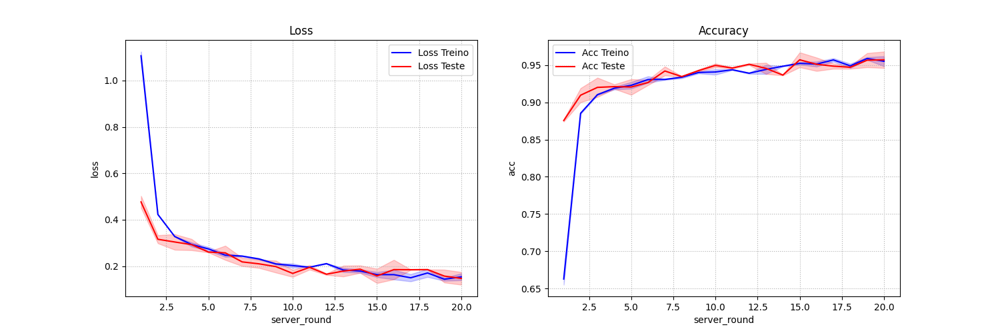
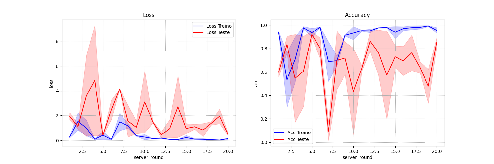
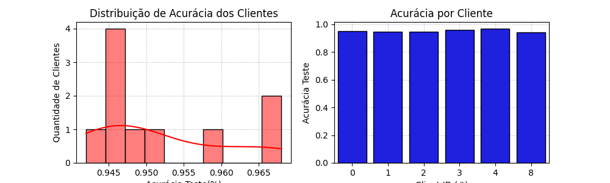
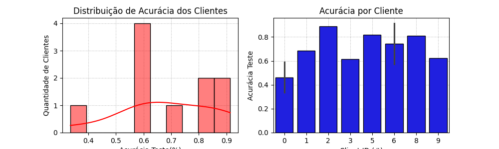

# MO809A
Topicos de computacion distribuida
# Implementação de Aprendizado Federado Cross-Device com Flower

Este projeto tem como objetivo implementar uma abordagem de aprendizado federado **cross-device** utilizando o framework [Flower](https://flower.dev/). A implementação irá separar os dados no formato cross-device, implementar algoritmos de seleção para treinar e avaliar diferentes conjuntos de clientes, e gerar visualizações considerando dados **IID** (Independentemente e Identicamente Distribuídos) e **Não-IID**.

## Sumário

- [Descrição do Projeto](#descrição-do-projeto)
- [Pré-requisitos](#pré-requisitos)
- [Estrutura do Projeto](#estrutura-do-projeto)
- [Implementação](#implementação)
  - [Separação dos Dados](#separação-dos-dados)
  - [Seleção de Clientes](#seleção-de-clientes)
  - [Modificação dos Métodos `configure_fit` e `configure_evaluate`](#modificação-dos-métodos-configure_fit-e-configure_evaluate)
  - [Visualizações IID e Não-IID](#visualizações-iid-e-não-iid)
- [Execução](#execução)
- [Resultados](#resultados)


## Descrição do Projeto

No aprendizado federado **cross-device**, uma grande quantidade de dispositivos de usuários finais (como smartphones e tablets) participam do treinamento de um modelo global sem compartilhar seus dados privados. Nesta implementação, utilizaremos o Flower para simular esse cenário, adaptando o código base para:

- Separar os dados de forma apropriada para o cenário cross-device.
- Implementar algoritmos de seleção de clientes para treinamento e avaliação.
- Gerar visualizações que considerem dados IID e Não-IID.

## Pré-requisitos

- **Python 3.7** ou superior
- **Bibliotecas Python**:
  - `flwr`
  - `tensorflow` 
  - `numpy`
  - `matplotlib` (para visualizações)

## **Estrutura do Projeto**:

   - `server.py`: Código do servidor Flower.
    - `client.py`: Código do cliente Flower.
    - `plot.py`: Script para gerar visualizações dos resultados.

## **Implementação**:

### Separação dos Dados

Para simular o cenário cross-device, os dados foram divididos em vários pequenos conjuntos, cada um representando os dados locais de um dispositivo cliente. A divisão foi feita de duas maneiras:

- Dados IID: Os dados são distribuídos aleatoriamente entre os clientes.
- Dados Não-IID: Cada cliente recebe dados de apenas algumas classes específicas.

### Seleção de Clientes
Implementamos algoritmos de seleção para escolher diferentes conjuntos de clientes para treinamento e avaliação:

- Treinamento: Um subconjunto de clientes é selecionado para treinar o modelo em cada rodada.
- Avaliação: Um conjunto diferente de clientes é selecionado exclusivamente para avaliar o modelo global.

### Modificação dos Métodos `configure_fit` e `configure_evaluate`


No servidor Flower (`server.py`), modificamos os métodos `configure_fit` e `configure_evaluate` para implementar a seleção personalizada de clientes.

### Visualizações IID e Não-IID
O script `plot.py` gera gráficos comparativos do desempenho do modelo treinado com dados IID e Não-IID, permitindo analisar o impacto da distribuição dos dados no aprendizado federado.


## **Execução**:

```
python run_simulation.py
```


## **Resultados**:

### Resultados IID - Loss e Acurácia



### Resultados Não-IID - Loss e Acurácia




### Resultados Distribuição e Acurácia por Cliente - IID




### Resultados Distribuição e Acurácia por Cliente - Não-IID
 



